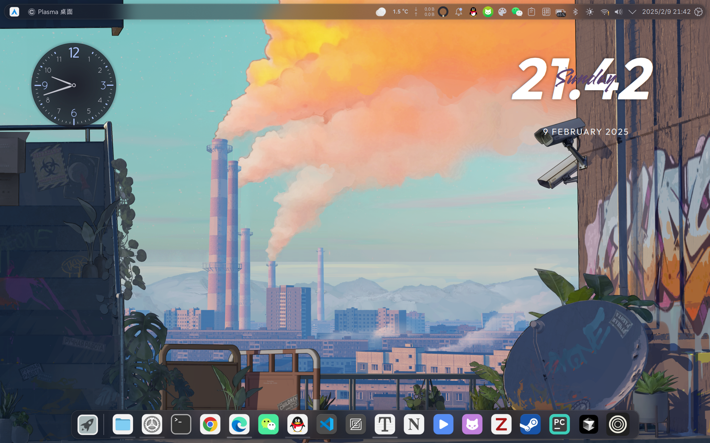
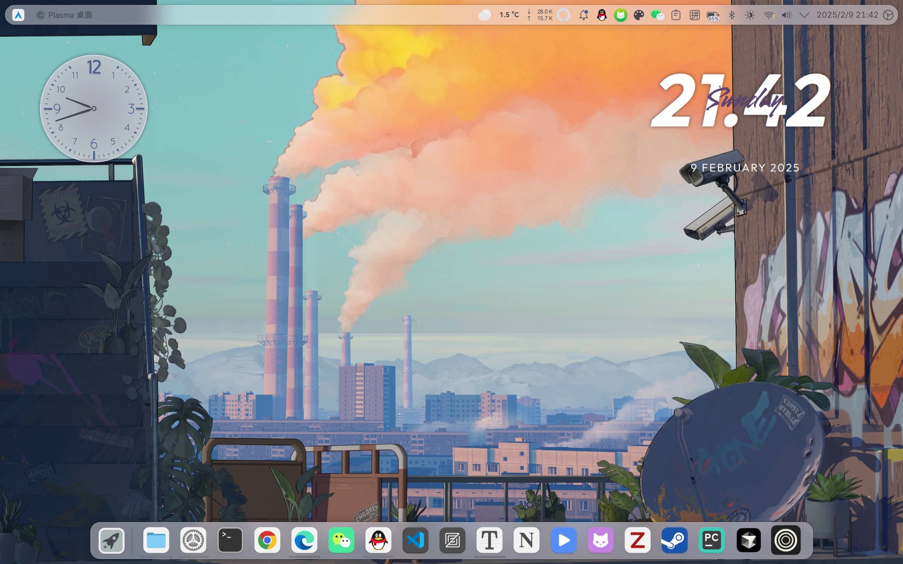
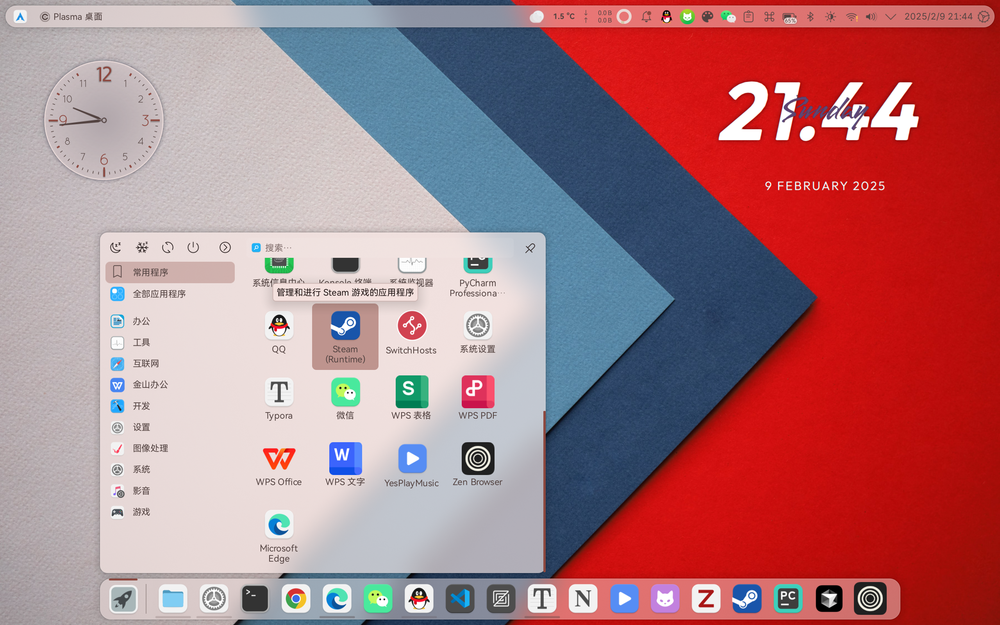

# Colorful Plasma Theme

基于[Colloid Kde](https://github.com/vinceliuice/Colloid-kde)与[Rounded Color](https://github.com/varlesh/rounded)修改的kde plasma theme，根据Kde Color Scheme自动切换浅色与深色模式，同时应用系统重点色。

